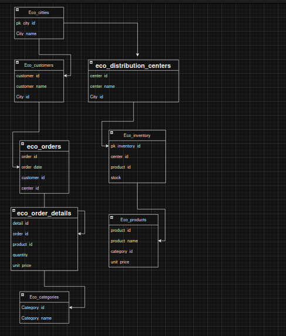

# EcoMarket Relational Database Project

## Project Description

This project was developed as part of the Relational Databases Module.

The objective is to transform an unstructured Excel file containing duplicated, inconsistent, and redundant information into a normalized relational database capable of supporting EcoMarket's daily operations.

The database was designed following database normalization principles up to Third Normal Form (3NF), ensuring data integrity, eliminating redundancy, and improving query performance.

---

# Business Problem

EcoMarket manages information about:

- Customers
- Products
- Categories
- Distribution Centers
- Inventory
- Orders
- Order Details
- Cities

The original Excel file presented several problems:

- Duplicate customers
- Duplicate products
- Inconsistent category names
- Repeated distribution centers
- Different spellings of cities
- Missing order information
- Data redundancy
- Inventory inconsistencies

The purpose of this project is to redesign the information using a relational database.

---

# Technologies Used

- MySQL (or PostgreSQL)
- Draw.io
- Git
- GitHub
- CSV Files
- SQL

---

# Database Engine

MySQL 8.0

---

# Development Process

## Step 1 — Analyze the Excel File

The first step was to inspect the Excel document.

The following problems were identified:

- Duplicate customer names
- Duplicate products
- Repeated categories
- Repeated cities
- Multiple distribution centers with the same information
- Redundant order data
- Product information repeated in every order

These issues made the database difficult to maintain and produced inconsistent reports.

---

## Step 2 — Identify Entities

After analyzing the business, the information was divided into independent entities.

The final entities are:

- Cities
- Customers
- Categories
- Products
- Distribution Centers
- Inventory
- Orders
- Order Details

Each entity represents a real business object.

---

## Step 3 — Apply First Normal Form (1NF)

The original Excel contained repeating groups and duplicated values.

To satisfy First Normal Form:

- Every row stores only one value per column.
- Every record has a primary key.
- Repeated groups were removed.

---

## Step 4 — Apply Second Normal Form (2NF)

Second Normal Form requires that every non-key attribute depends entirely on its primary key.

Actions performed:

- Customer information was separated from Orders.
- Product information was separated from Order Details.
- Categories were stored independently.
- Distribution Centers became an independent entity.

---

## Step 5 — Apply Third Normal Form (3NF)

Third Normal Form removes transitive dependencies.

Actions performed:

- Cities were stored in a separate table.
- Categories became an independent entity.
- Inventory was separated from Products.
- Distribution Centers were separated from Orders.

After this process, the database reached Third Normal Form.

---

# Final Database Schema

The database contains eight tables.

## eco_cities

Stores city information.

Fields:

- city_id
- city_name

---

## eco_customers

Stores customer information.

Fields:

- customer_id
- customer_name
- city_id

---

## eco_categories

Stores product categories.

Fields:

- category_id
- category_name

---

## eco_products

Stores products.

Fields:

- product_id
- product_name
- category_id
- unit_price

---

## eco_distribution_centers

Stores warehouse information.

Fields:

- center_id
- center_name
- city_id

---

## eco_inventory

Stores inventory by distribution center.

Fields:

- inventory_id
- center_id
- product_id
- stock_quantity

---

## eco_orders

Stores customer orders.

Fields:

- order_id
- order_date
- customer_id
- center_id

---

## eco_order_details

Stores products included in each order.

Fields:

- detail_id
- order_id
- product_id
- quantity
- unit_price

---

# Entity Relationship Diagram

The Entity Relationship Diagram includes:

- Primary Keys
- Foreign Keys
- Relationships
- Cardinalities

The diagram was created using Draw.io.

---

# Database Creation

Create the database.


```sql
CREATE DATABASE bd_Johana_Bolivar_PuertaDeOror;
```

Execute the DDL script:

```
ddl.sql
```

This script creates:

- Tables
- Primary Keys
- Foreign Keys
- Constraints
- Unique indexes

---

# Data Loading

The original Excel file was cleaned before loading.

Duplicate records were removed.

The data was separated into CSV files according to each entity:

- cities.csv
- customers.csv
- categories.csv
- products.csv
- distribution_centers.csv
- inventory.csv
- orders.csv
- order_details.csv

Data can be imported using:

- LOAD DATA INFILE
- Import Wizard
- CSV Import
- INSERT scripts

---

# DML Operations

The project includes:

## INSERT

Register a new customer with an associated order.

---

## UPDATE

Update distribution center information.

---

## DELETE

Delete a product only if it has no associated orders.

Foreign Key constraints prevent invalid deletions.

---

# SQL Queries

The project includes six business queries.

## Query 1

Available inventory by product.

Purpose:

Help the purchasing department plan future purchases.

---

## Query 2

Order history by city.

Purpose:

Identify cities with the highest number of orders.

---

## Query 3

Total sales by category.

Purpose:

Determine which categories generate the highest revenue.

---

## Query 4

Products with the lowest inventory.

Purpose:

Identify products that need restocking.

---

## Query 5

Customers with the highest number of orders.

Purpose:

Identify the most active customers.

---

## Query 6

Inventory value by distribution center.

Purpose:

Calculate the economic value stored in each warehouse.

---

# Additional Features

Two SQL Views were created:

- Commercial Sales Summary
- Inventory Analysis

A Stored Procedure was implemented:

```
sp_get_customer()
```

Behavior:

- If an ID is received, it returns that customer.
- If NULL is received, it returns all customers.

---

# Project Structure

```
project/
│
├── ddl.sql
├── dml.sql
├── queries.sql
├── procedures.sql
├── views.sql
├── README.md
├── excel/
│      data.xlsx
├── csv/
│      cities.csv
│      customers.csv
│      products.csv
│      categories.csv
│      inventory.csv
│      orders.csv
│      order_details.csv
├── images/
│      relational_model.png
└── evidence/
       screenshots/
```

---

# Developer

Name: Johana Bolivar
Clan:Puerta de Oro